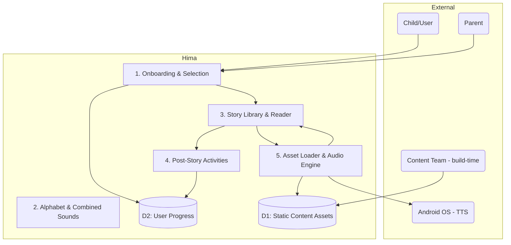

# Data Flow Diagram (DFD) for Hima

Version: 1.0

Date: August 28, 2025

## Overview

This document describes the high-level data flows for Hima (short for Hindi Marathi), an offline Android app for children that teaches alphabets, combined sounds, and CBSE-based textbook stories with post-reading activities. The DFDs clarify system boundaries, external entities, major processes, data stores, and key data flows prior to implementation.

Notes:
- The app is 100% functional offline. All content (JSON, audio, emoji artwork) is bundled as static assets.
- Audio assets are pre-generated during development (AI-assisted or professionally recorded) and packaged with the app.
- Android on-device language packs (offline TTS / optional on-device voice recognition) may be used as a fallback only.

## Legend

- External Entities: Entities outside the system boundary (users, content providers).
- Processes: Numbered functional modules that transform inputs to outputs.
- Data Stores: Persistent local storage (assets, databases, preferences).
- Data Flows: Named flows of data between entities, processes, and stores.

## Context Diagram (Level 0)

External Entities:
- Child (Primary User)
- Parent / Guardian (Installer / occasional supervisor)
- Content Preprocessing Team (external to runtime; provides processed JSON/audio)
- Android OS (provides on-device TTS/Language packs)

System: Hima (Mobile App)

High-level flows:
- Child -> Hima: interactions (taps, selections)
- Hima -> Child: UI, audio playback, visuals, activity prompts
- Parent -> Hima: installs app, optionally configures language/profile
- Content Team -> Hima (build-time): JSON, audio, emoji assets (bundled)
- Android OS <-> Hima: optional on-device TTS calls (offline)

Mermaid (context) [renderers that support Mermaid can visualize this]:

```mermaid
graph LR
  Child[Child (User)] -->|Selects language/grade/story| Hima[Hima App]
  Parent[Parent/Guardian] -->|Installs / Sets profile| Hima
  ContentTeam[Content Preprocessing]
  ContentTeam -->|Bundles JSON & audio at build-time| Hima
  Hima -->|Uses offline TTS packs| AndroidOS[Android OS]
  Hima -->|Plays audio, shows UI| Child
```

## Level 0 DFD (Major Processes)

Processes:
1. Onboarding & Selection
2. Alphabet & Combined Sounds Module
3. Story Library & Reader
4. Post-Story Activities & Assessments
5. Asset Loader & Audio Engine
6. Local Progress Store

Data Stores:
- D1: Static Content Assets (JSON, audio files, emoji/artwork) — packaged in assets/ or app bundle
- D2: User Progress (local DB or SharedPreferences) — stores stars, completed stories, last position

Primary flows (examples):
- Child -> P1 (language choice)
- P1 -> D2 (save selected language/profile)
- P1 -> P3 (grade & chapter selection)
- P3 -> P5 (request page assets & narration audio)
- P5 -> D1 (load JSON and audio)
- P5 -> P3 (deliver page data)
- P3 -> Child (render page, play audio)
- P3 -> P4 (on story completion -> trigger activities)
- P4 -> D2 (save stars / completion)

Mermaid (Level 0):



## Level 1: Key Process Details

1. Onboarding & Selection
- Inputs: first-launch flag, user taps, parent-config.
- Outputs: selected language, selected profile, main-menu route.
- Data stores touched: D2 (persist language/profile).

2. Alphabet & Combined Sounds Module
- Inputs: selected language, request for letter or consonant+vowel pair.
- Operations: present Vowels/Consonants tabs, show letter glyph, play pre-generated audio, show stroke animation/tracing canvas, display 2-3 emoji examples, handle practice drills cycling vowels.
- Outputs: practice completion, earned stars.
- Data stores touched: D1 (assets), D2 (progress updates).

3. Story Library & Reader
- Inputs: selected grade & chapter, story selection.
- Operations: list story tiles (emoji cover), load story JSON, render page-by-page, highlight vocabulary, show vocab pop-up with emoji + meaning + listen button, play page narration or per-word audio.
- Outputs: navigation events, story-completion event.
- Data stores touched: D1, D2.

4. Post-Story Activities & Assessments
- Inputs: story-completion event.
- Operations: show vocabulary list, comprehension Q&A (Show Answer), reading practice (audio prompt; no speech recognition required), writing practice (Show Me reveal), compute stars.
- Outputs: updated user progress, stars award.
- Data stores touched: D2.

5. Asset Loader & Audio Engine
- Inputs: asset requests (JSON, audio file paths), TTS fallback triggers.
- Operations: load and cache JSON and audio from packaged assets, play audio via Android Media APIs, fall back to on-device TTS for missing audio; ensure offline operations.
- Outputs: audio streams, parsed page objects.
- Data stores touched: D1 (read-only).

## Data Stores (Detailed)

- D1: Static Content Assets
  - Contents: letter entries, combined-sound entries, story JSON, vocabulary lists, emoji art, audio files (mp3/ogg), stroke animations (Lottie or sprite JSON).
  - Location: packaged assets/ or served via Play Asset Delivery / OBB for large datasets.

- D2: User Progress
  - Contents: user profile(s), selected language, completed stories (ids), stars earned, last-read page indices, timestamps.
  - Implementation: Room DB or SharedPreferences for simple fields.

## Key Data Contracts (examples)

- Letter JSON (example):

```json
{
  "id": "h_letter_01",
  "language": "hindi",
  "char": "अ",
  "audio": "audio/letters/h/अ.mp3",
  "stroke_anim": "animations/letters/h/अ.json",
  "examples": [
    {"word":"अदरक","emoji":"🫚","audio":"audio/words/adarak.mp3"}
  ]
}
```

- Combined sound JSON (example):

```json
{
  "id": "ka_aa",
  "base": "क",
  "vowel": "ा",
  "combined": "का",
  "audio": "audio/combined/का.mp3",
  "stroke_anim": "animations/combined/का.json"
}
```

- Story page JSON (example):

```json
{
  "storyId": "std1_story3",
  "pageNo": 1,
  "text": "कहानी का पहला पृष्ठ",
  "emoji": "📘",
  "narration": "audio/stories/std1/story3/page1.mp3",
  "vocab": [
    {"word":"प्रभात","meaning":"morning","emoji":"🌅","audio":"audio/vocab/प्रभात.mp3"}
  ]
}
```

## Offline & Fallback Rules

- The app must not make runtime external network calls for AI or audio.
- All audio must be bundled; if a required audio file is missing or corrupted, the Asset Loader shall attempt to use Android on-device TTS language packs as a fallback for offline synthesis.
- If both bundled audio and on-device TTS are unavailable for a language, the app must show a visual cue and skip playback gracefully.

## Privacy & Security Notes

- All user progress is stored locally; no telemetry or remote sync is performed by default.
- If future analytics or sync is added, it must be opt-in and documented separately with privacy controls.

## Next steps before development

1. Review and confirm the processes and data stores in this DFD.
2. Produce JSON Schema (letters, combined sounds, story pages) and a validator tool to validate pre-processed content before packaging.
3. Create a small sample asset bundle (one letter, one combined sound, one story page) and run a quick prototype to exercise the Asset Loader and Audio Engine.

---

End of DFD
