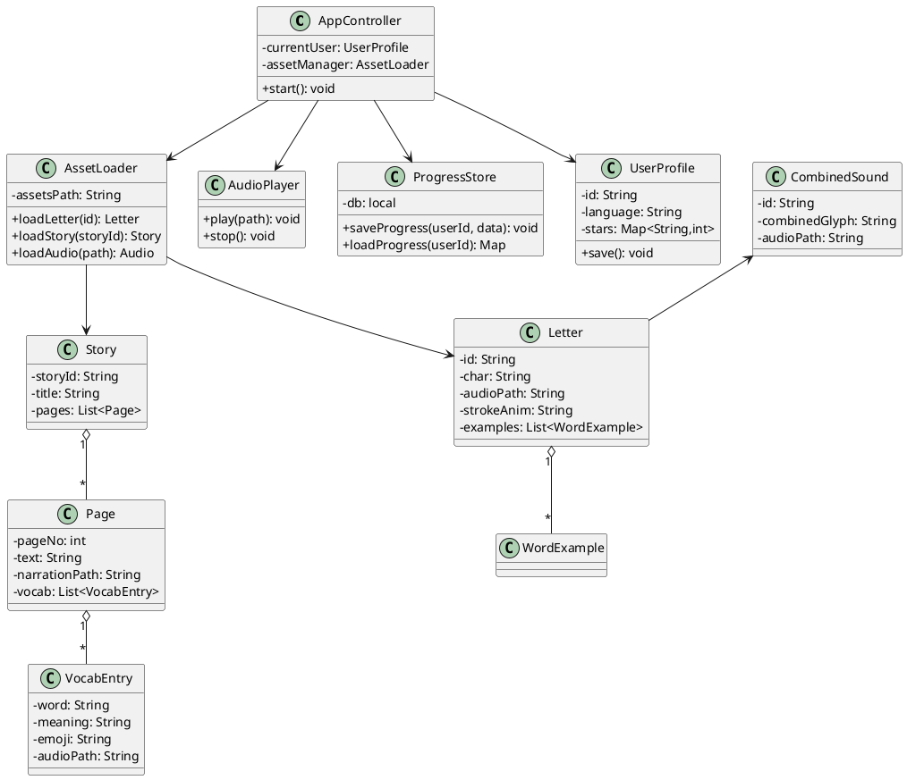
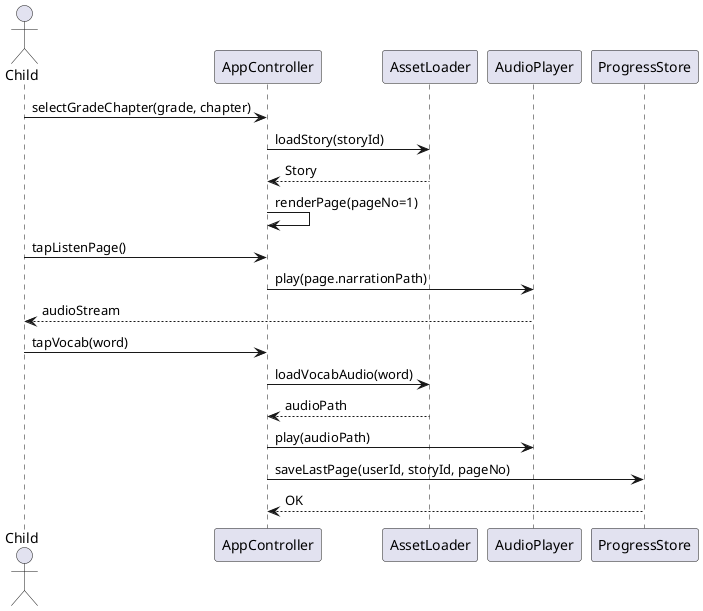

# Hima — UML Diagrams

Version: 1.0

Date: August 28, 2025

## Purpose

This document provides high-level UML diagrams for Hima (short for Hindi Marathi). It captures the main classes, components, and a key sequence flow to guide implementation and ensure alignment with the SRS.

All diagrams are illustrative — refine them during design/implementation.

## Class Diagram (PlantUML)

Below is a PlantUML class diagram sketch describing core domain classes and relationships.



Notes:
- `AssetLoader` reads the static JSON/audio assets (D1 in DFD).
- `ProgressStore` corresponds to D2 in the DFD (Room or SharedPreferences).

## Sequence Diagram — Reading a Story Page (PlantUML)



## Component Diagram (Mermaid)

```mermaid
graph LR
  UI[UI Layer (Activities/Fragments)] --> Controller[AppController]
  Controller --> Asset[Asset Loader]
  Controller --> Audio[Audio Player]
  Controller --> Store[Progress Store]
  Asset --> AssetsFolder[(Assets: JSON, audio, emoji)]
  Audio --> AndroidMedia[(Android Media APIs)]
  Audio --> AndroidTTS[(Android on-device TTS - fallback)]
```

## Notes on mapping to SRS

- Onboarding & Selection (FR-1) is handled by `AppController` + `UserProfile`.
- Alphabet & Combined Sounds (FR-2, FR-5) map to `Letter` and `CombinedSound` classes and flows through `AssetLoader` and `AudioPlayer`.
- Story Reader and Post-Story Activities (FR-3, FR-4) map to `Story`, `Page`, `VocabEntry`, and `ProgressStore`.
- Offline audio and fallback rules are handled by `AssetLoader` and `AudioPlayer` (use bundled audio; `AndroidTTS` as fallback).

## Next steps

1. Review diagrams and propose changes to class responsibilities (lightweight iteration).
2. Generate initial TypeScript/Kotlin data classes from the data contracts; create JSON Schema and validator (recommended next task).

End of UML
